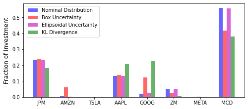

<script src="https://cdn.mathjax.org/mathjax/latest/MathJax.js?config=TeX-AMS-MML_HTMLorMML" type="text/javascript"></script>

### Conditional Value-at-Risk in Robust Portfolio

This robust portfolio management model is proposed by [Zhu and Fukushima (2009)](#ref1). The portfolio allocation is determined via minimizing the worst-case conditional value-at-risk (CVaR) under ambiguous distribution information. The generic formulation is given as

$$
\begin{align}
\min~&\max\limits_{\pmb{\pi}\in \Pi} \alpha + \frac{1}{1-\beta}\pmb{\pi}^{\top}\pmb{u} &\\
\text{s.t.}~& u_k \geq -\pmb{y}_k^{\top}\pmb{x} - \alpha, &\forall k = 1, 2, ..., s \\
&u_k \geq 0, &\forall k=1, 2, ..., s \\
&\sum\limits_{k=1}^s\pi_k\pmb{y}_k^{\top}\pmb{x} \geq \mu, &\forall \pmb{\pi} \in \Pi  \\
&\underline{\pmb{x}} \leq \pmb{x} \leq \overline{\pmb{x}} \\
&\pmb{1}^{\top}\pmb{x} = w_0
\end{align}
$$

with investment decisions \\(\pmb{x}\in\mathbb{R}^n\\) and auxiliary variables \\(\pmb{u}\in\mathbb{R}^s\\) and \\(\alpha\in\mathbb{R}\\), where \\(n\\) is the number of stocks, and \\(s\\) is the number of samples. The array \\(\pmb{\pi}\\) denotes the probabilities of samples, and \\(\Pi\\) is the uncertainty set that captures the distributional ambiguity of probabilities. The constant array \\(\pmb{y}_k\in\mathbb{R}^n\\) indicates the \\(k\\)th sample of stock return rates, and \\(\bar{x}\\) and \\(\underline{x}\\) are the lower and upper bounds of \\(x\\). The worst-case minimum expected overall return rate is set to be \\(\mu=0.001\\), the confidence level is \\(\beta=0.95\\), and the budget of investment is set to be \\(w_0=1\\). In this case study, we consider the sample data of eight stocks "JPM", "AMZN", "TSLA", "AAPL", "GOOG", "ZM", "META", and "MCD", in the year of 2021, and the other parameters are specified by the following code segment.

```python
import pandas as pd
import yfinance as yf

stocks = ['JPM', 'AMZN', 'TSLA', 'AAPL', 'GOOG', 'ZM', 'META', 'MCD']
start = '2021-1-2'              # starting date of historical data
end='2021-12-31'                # end date of historical data

data = pd.DataFrame([])
for stock in stocks:
    each = yf.Ticker(stock).history(start=start, end=end)
    close = each['Close'].values
    returns = (close[1:] - close[:-1]) / close[:-1]
    data[stock] = returns

data
```

<div>
<table border="1" class="dataframe mystyle">
  <thead>
    <tr style="text-align: right;">
      <th></th>
      <th>JPM</th>
      <th>AMZN</th>
      <th>TSLA</th>
      <th>AAPL</th>
      <th>GOOG</th>
      <th>ZM</th>
      <th>META</th>
      <th>MCD</th>
    </tr>
  </thead>
  <tbody>
    <tr>
      <th>0</th>
      <td>0.005441</td>
      <td>0.010004</td>
      <td>0.007317</td>
      <td>0.012364</td>
      <td>0.007337</td>
      <td>0.002361</td>
      <td>0.007548</td>
      <td>0.005994</td>
    </tr>
    <tr>
      <th>1</th>
      <td>0.046956</td>
      <td>-0.024897</td>
      <td>0.028390</td>
      <td>-0.033662</td>
      <td>-0.003234</td>
      <td>-0.045506</td>
      <td>-0.028269</td>
      <td>-0.002270</td>
    </tr>
    <tr>
      <th>2</th>
      <td>0.032839</td>
      <td>0.007577</td>
      <td>0.079447</td>
      <td>0.034123</td>
      <td>0.029943</td>
      <td>-0.005546</td>
      <td>0.020622</td>
      <td>0.004645</td>
    </tr>
    <tr>
      <th>3</th>
      <td>0.001104</td>
      <td>0.006496</td>
      <td>0.078403</td>
      <td>0.008631</td>
      <td>0.011168</td>
      <td>0.020759</td>
      <td>-0.004354</td>
      <td>0.018351</td>
    </tr>
    <tr>
      <th>4</th>
      <td>0.014924</td>
      <td>-0.021519</td>
      <td>-0.078214</td>
      <td>-0.023249</td>
      <td>-0.022405</td>
      <td>-0.034038</td>
      <td>-0.040102</td>
      <td>-0.007597</td>
    </tr>
    <tr>
      <th>...</th>
      <td>...</td>
      <td>...</td>
      <td>...</td>
      <td>...</td>
      <td>...</td>
      <td>...</td>
      <td>...</td>
      <td>...</td>
    </tr>
    <tr>
      <th>245</th>
      <td>0.003574</td>
      <td>0.000184</td>
      <td>0.057619</td>
      <td>0.003644</td>
      <td>0.001317</td>
      <td>-0.007663</td>
      <td>0.014495</td>
      <td>0.003812</td>
    </tr>
    <tr>
      <th>246</th>
      <td>0.005723</td>
      <td>-0.008178</td>
      <td>0.025248</td>
      <td>0.022975</td>
      <td>0.006263</td>
      <td>-0.021967</td>
      <td>0.032633</td>
      <td>0.008610</td>
    </tr>
    <tr>
      <th>247</th>
      <td>0.003035</td>
      <td>0.005844</td>
      <td>-0.005000</td>
      <td>-0.005767</td>
      <td>-0.010914</td>
      <td>-0.019580</td>
      <td>0.000116</td>
      <td>-0.001342</td>
    </tr>
    <tr>
      <th>248</th>
      <td>-0.000504</td>
      <td>-0.008555</td>
      <td>-0.002095</td>
      <td>0.000502</td>
      <td>0.000386</td>
      <td>-0.010666</td>
      <td>-0.009474</td>
      <td>0.002277</td>
    </tr>
    <tr>
      <th>249</th>
      <td>-0.000505</td>
      <td>-0.003289</td>
      <td>-0.014592</td>
      <td>-0.006578</td>
      <td>-0.003427</td>
      <td>0.047907</td>
      <td>0.004141</td>
      <td>-0.004767</td>
    </tr>
  </tbody>
</table>
<p>250 rows × 8 columns</p>
</div>


```python
import numpy as np

y = data.values     # stock data as an array
s, n = y.shape      # s: sample size; n: number of stocks

x_lb = np.zeros(n)  # lower bounds of investment decisions
x_ub = np.ones(n)   # upper bounds of investment decisions

beta =0.95          # confidence interval
w0 = 1              # investment budget
mu = 0.001          # target minimum expected return rate
```

#### Nominal CVaR model

In the nominal model, the CVaR and expected returns are evaluated assuming the exact distribution of stock returns is accurately represented by the historical samples without any distributional ambiguity. In other words, \\(\Pi\\) is written as a singleton uncertainty \\(\Pi = \\{\pmb{\pi}^0 \\}\\), where \\(\pi_k^0=1/s\\), with \\(k=1, 2, ..., s\\). The Python code for implementing the nominal model is given below.

```python
from rsome import ro
from rsome import msk_solver as msk

model = ro.Model()

pi = np.ones(s) / s

x = model.dvar(n)
u = model.dvar(s)
alpha = model.dvar()

model.min(alpha + 1/(1-beta) * (pi@u))
model.st(u >= -y@x - alpha)
model.st(u >= 0)
model.st(pi@y@x >= mu)
model.st(x >= x_lb, x <= x_ub, x.sum() == w0)

model.solve(msk)
```

```
Being solved by Mosek...
Solution status: Optimal
Running time: 0.0208s
```

The portfolio decision for the nominal model is retrieved by the following code.

```python
x_nom = x.get()
model.get()
```

```
0.018195323668177367
```

#### Worst-case CVaR model with box uncertainty
Now we consider a box uncertainty set

$$
\Pi = \left\{\pmb{\pi}: \pmb{\pi} = \pmb{\pi}^0 + \pmb{\eta}, \pmb{1}^{\top}\pmb{\eta}=0, \underline{\pmb{\eta}}\leq \pmb{\eta} \leq \bar{\pmb{\eta}} \right\}.
$$

In this case study, we assume that \\(-\underline{\pmb{\eta}}=\bar{\pmb{\eta}}=0.0001\\), and the Python code for implementation is provided below.

```python
from rsome import ro
from rsome import msk_solver as msk

model = ro.Model()

eta_ub = 0.0001                 # upper bound of eta
eta_lb = -0.0001                # lower bound of eta

eta = model.rvar(s)             # eta as random variables
uset = (eta.sum() == 0,
        eta >= eta_lb,
        eta <= eta_ub)
pi = 1/s + eta                  # pi as inexact probabilities

x = model.dvar(n)
u = model.dvar(s)
alpha = model.dvar()

model.minmax(alpha + 1/(1-beta) * (pi@u), uset)
model.st(u >= -y@x - alpha)
model.st(u >= 0)
model.st(pi@y@x >= mu)
model.st(x >= x_lb, x <= x_ub, x.sum() == w0)

model.solve(msk)
```

```
Being solved by Mosek...
Solution status: Optimal
Running time: 0.0208s
```

```python
x_box = x.get()
model.get()
```

```
0.018541181700867923
```

#### Worst-case CVaR model with ellipsoidal uncertainty

In cases that \\(\Pi\\) is an ellipsoidal uncertainty set

$$
\Pi = \left\{\pmb{\pi}: \pmb{\pi} = \pmb{\pi}^0 + \rho\pmb{\eta}, \pmb{1}^{\top}\pmb{\eta}=0, \pmb{\pi}^0 + \rho\pmb{\eta} \geq \pmb{0}, \|\pmb{\eta}\| \leq 1 \right\},
$$

where the nominal probability \\(\pmb{\pi}^0\\) is the center of the ellipsoid, and the constant \\(\rho=0.001\\), then the model can be implemented by the code below.

```python
from rsome import ro
from rsome import msk_solver as msk
import rsome as rso

model = ro.Model()

rho = 0.001

eta = model.rvar(s)
uset = (eta.sum() == 0, 1/s + rho*eta >= 0,
        rso.norm(eta) <= 1)
pi = 1/s + rho*eta

x = model.dvar(n)
u = model.dvar(s)
alpha = model.dvar()

model.minmax(alpha + 1/(1-beta) * (pi@u), uset)
model.st(u >= -y@x - alpha)
model.st(u >= 0)
model.st(pi@y@x >= mu)
model.st(x >= x_lb, x <= x_ub, x.sum() == w0)

model.solve(grb)
```

```
Being solved by Mosek...
Solution status: Optimal
Running time: 0.0284s
```

```python
x_ellip = x.get()
model.get()
```

```
0.018270742978340224
```

#### Worst-case CVaR with KL divergence
Here, we consider the KL divergence-constrained ambiguity of probabilities

$$
\Pi = \left\{\boldsymbol{\pi}: \boldsymbol{\pi} \geq 0, \boldsymbol{1}^{\top}\boldsymbol{\pi} = 1, \sum_{k=1}^s\pi_k\log(\pi_k/\hat{\pi}_k) \leq \epsilon \right\}, 
$$

where \\(\hat{\pi}_k = 1/s\\) is the empirical probability of each sample. Assume that the constant \\(\epsilon=0.001\\), the code for implementing such a robust model is given below.

```python
from rsome import ro
from rsome import msk_solver as msk
import rsome as rso

model = ro.Model()

epsilon = 0.001

pi = model.rvar(s)
uset = (pi.sum() ==1, pi >= 0,
        rso.kldiv(pi, 1/s, epsilon))    # uncertainty set of pi

x = model.dvar(n)
u = model.dvar(s)
alpha = model.dvar()

model.minmax(alpha + 1/(1-beta) * (pi@u), uset)
model.st(u >= -y@x - alpha)
model.st(u >= 0)
model.st(pi@y@x >= mu)
model.st(x >= x_lb, x <= x_ub, x.sum() == w0)

model.solve(msk)
```

```
Being solved by Mosek...
Solution status: Optimal
Running time: 0.0936s
```

```python
x_kld = x.get()
model.get()
```

```
0.02128303758055805
```

#### Visualization of portfolio decisions

Decisions in terms of the allocations of capital in each stock are shown by the figure below.

```python
import matplotlib.pyplot as plt

xdata = np.arange(n)
width = 0.15

plt.figure(figsize=(8, 3.5))
plt.bar(xdata - 1.5*width, x_nom, 
        width=width, color='b', alpha=0.6, label='Nominal Distribution')
plt.bar(xdata - 0.5*width, x_box, 
        width=width, color='r', alpha=0.6, label='Box Uncertainty')
plt.bar(xdata + 0.5*width, x_ellip, 
        width=width, color='m', alpha=0.6, label='Ellipsoidal Uncertainty')
plt.bar(xdata + 1.5*width, x_kld, 
        width=width, color='g', alpha=0.6, label='KL Divergence')

plt.legend()
plt.ylabel('Fraction of Investment', fontsize=12)
plt.xticks(xdata, data.columns)
plt.show()
```



In this example, we show that data acquisition tools provided in the Python ecosystem (<i>e.g.</i>, `pandas-datareader`) can be readily used to collect and feed real data into RSOME models.  Apart from acquiring data, rich machine learning tools in the Python ecosystem can also be used to develop data-driven optimization models. More such examples will be provided in introducing the `dro` module for modeling distributionally robust optimization problems.  

<br>
#### Reference

<a id="ref1"></a>

Zhu, Shushang, and Masao Fukushima. 2009. [Worst-case conditional value-at-risk with application to robust portfolio management](https://pubsonline.informs.org/doi/abs/10.1287/opre.1080.0684). <i>Operations Research</i> <b>57</b>(5) 1155-1168.
