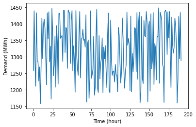

<script src="https://cdn.mathjax.org/mathjax/latest/MathJax.js?config=TeX-AMS-MML_HTMLorMML" type="text/javascript"></script>

### The Unit Commitment Problem

In this example, we attempt to solve a [unit commitment (UC) problem](http://ibmdecisionoptimization.github.io/docplex-doc/mp/ucp_pandas.html) described in the tutorial of IBM Decision Optimization CPLEX for Python (DOcplex). The electricity demand data and parameters of all generators are read from the data file [uc_data.xlsx](uc_data.xlsx), by code segments below.

```python
import pandas as pd
import matplotlib.pyplot as plt

demand = pd.read_excel('uc_data.xlsx', 'Demand')     # Electricity demand 
plt.plot(demand.index, demand['load'])
plt.xlabel('Time (hour)')
plt.ylabel('Demand (MWh)')
plt.show()

units = pd.read_excel('uc_data.xlsx', 'Units')       # Parameters of generators
units
```



<div>
<table border="1" class="dataframe mystyle">
  <thead>
    <tr style="text-align: right;">
      <th></th>
      <th>name</th>
      <th>energy</th>
      <th>initial</th>
      <th>min_gen</th>
      <th>...</th>
      <th>start_cost</th>
      <th>fixed_cost</th>
      <th>variable_cost</th>
      <th>co2_cost</th>
    </tr>
  </thead>
  <tbody>
    <tr>
      <th>0</th>
      <td>coal1</td>
      <td>coal</td>
      <td>400</td>
      <td>100.00</td>
      <td>...</td>
      <td>5000</td>
      <td>208.610</td>
      <td>22.536</td>
      <td>30</td>
    </tr>
    <tr>
      <th>1</th>
      <td>coal2</td>
      <td>coal</td>
      <td>350</td>
      <td>140.00</td>
      <td>...</td>
      <td>4550</td>
      <td>117.370</td>
      <td>31.985</td>
      <td>30</td>
    </tr>
    <tr>
      <th>2</th>
      <td>gas1</td>
      <td>gas</td>
      <td>205</td>
      <td>78.00</td>
      <td>...</td>
      <td>1320</td>
      <td>174.120</td>
      <td>70.500</td>
      <td>5</td>
    </tr>
    <tr>
      <th>3</th>
      <td>gas2</td>
      <td>gas</td>
      <td>52</td>
      <td>52.00</td>
      <td>...</td>
      <td>1291</td>
      <td>172.750</td>
      <td>69.000</td>
      <td>5</td>
    </tr>
    <tr>
      <th>4</th>
      <td>gas3</td>
      <td>gas</td>
      <td>155</td>
      <td>54.25</td>
      <td>...</td>
      <td>1280</td>
      <td>95.353</td>
      <td>32.146</td>
      <td>5</td>
    </tr>
    <tr>
      <th>5</th>
      <td>gas4</td>
      <td>gas</td>
      <td>150</td>
      <td>39.00</td>
      <td>...</td>
      <td>1105</td>
      <td>144.520</td>
      <td>54.840</td>
      <td>5</td>
    </tr>
    <tr>
      <th>6</th>
      <td>diesel1</td>
      <td>diesel</td>
      <td>78</td>
      <td>17.40</td>
      <td>...</td>
      <td>560</td>
      <td>54.417</td>
      <td>40.222</td>
      <td>15</td>
    </tr>
    <tr>
      <th>7</th>
      <td>diesel2</td>
      <td>diesel</td>
      <td>76</td>
      <td>15.20</td>
      <td>...</td>
      <td>554</td>
      <td>54.551</td>
      <td>40.522</td>
      <td>15</td>
    </tr>
    <tr>
      <th>8</th>
      <td>diesel3</td>
      <td>diesel</td>
      <td>0</td>
      <td>4.00</td>
      <td>...</td>
      <td>300</td>
      <td>79.638</td>
      <td>116.330</td>
      <td>15</td>
    </tr>
    <tr>
      <th>9</th>
      <td>diesel4</td>
      <td>diesel</td>
      <td>0</td>
      <td>2.40</td>
      <td>...</td>
      <td>250</td>
      <td>16.259</td>
      <td>76.642</td>
      <td>15</td>
    </tr>
  </tbody>
</table>
<p>10 rows × 14 columns</p>
</div>

Parameters of the UC model are specified by the code segment below,

```python
g_init = units['initial'].values
u_init = (g_init > 0).astype(int)
g_min = units['min_gen'].values
g_max = units['max_gen'].values
h_up = units['min_uptime'].values
h_down = units['min_downtime'].values
r_up = units['ramp_up'].values
r_down = units['ramp_down'].values
a = units['fixed_cost'].values
b = units['variable_cost'].values
c = units['start_cost'].values
d = demand['load'].values
e = units['co2_cost'].values
```

and detailed information on these parameters is provided in the following table.

| Notation | Interpretation | Array Expression | Python Variable |
|:----|:----|:----|
| \\(g_n^{\text{init}}\\) | The initial output of the \\(n\\)th generator | `units['initial'].values` | `g_init` |
| \\(u_n^{\text{init}}\\) | The initial on/off status of the \\(n\\)th generator | `(g_init > 0).astype(int)` | `u_init` |
| \\(g_n^{\text{min}}\\) | The minimum capacity of the \\(n\\)th generator | `units['min_gen'].values` | `g_min` |
| \\(g_n^{\text{max}}\\) | The maximum capacity of the \\(n\\)th generator | `units['max_gen'].values` | `g_max` |
| \\(h_n^{\text{up}}\\) | The minimum up time of the \\(n\\)th generator | `units['min_uptime'].values` | `h_up` |
| \\(h_n^{\text{down}}\\) | The minimum down time of the \\(n\\)th generator | `units['min_downtime'].values` | `h_down` |
| \\(r_n^{\text{up}}\\) | The ramp-up rate limit of the \\(n\\)th generator | `units['ramp_up'].values` | `r_up` |
| \\(r_n^{\text{down}}\\) | The ramp-down rate limit of the \\(n\\)th generator | `units['ramp_down'].values` | `r_down` |
| \\(a_n\\) | The fixed cost of the \\(n\\)th generator | `units['fixed_cost'].values` | `a` |
| \\(b_n\\) | The variable cost of the \\(n\\)th generator | `units['variable_cost'].values` | `b` |
| \\(c_n\\) | The start-up cost of the \\(n\\)th generator | `units['start_cost'].values` | `c` |
| \\(d_t\\) | The demand at time step \\(t\\) | `demand['load'].values` | `d` |
| \\(e_t\\) | The CO2 emission cost  of the \\(n\\)th generator | `units['co2_cost'].values` | `e` |

The UC model that determines the on/off statues of generators and their outputs in supplying the electricity demand can be written as the following mixed-integer linear programming problem.

$$
\begin{align}
\min~&\sum\limits_{t=1}^T\sum\limits_{n=1}^N\left(a_nu_{tn} + b_ng_{tn} + c_nv_{tn} + e_ng_{tn}\right) \hspace{-1in}& \\
\text{s.t.}~&v_{1n} \geq u_{1n} - u_n^{\text{init}}, v_{1n} \geq 0 &\forall n= 1, ..., N \\
&v_{tn} \geq u_{tn} - u_{(t-1)u}, v_{tn} \geq 0 & \forall t = 2, ..., T, \forall n = 1, ..., N \\
&w_{1n} \geq u_n^{\text{init}} - u_{1n}, w_{1n} \geq 0 &\forall n= 1, ..., N \\
&w_{tn} \geq u_{(t-1)u} - u_{tn}, w_{tn} \geq 0 & \forall t = 2, ..., T, \forall n = 1, ..., N \\
&\sum\limits_{k=t-h_n^{\text{up}}+1}^tv_{tn} \leq u_{tn} & \forall t=h_n^{\text{up}}, ..., T, \forall n = 1, ..., N \\
&\sum\limits_{k=t-h_n^{\text{down}}+1}^tw_{tn} \leq 1 - u_{tn} & \forall t=h_n^{\text{down}}, ..., T, \forall n = 1, ..., N \\
&\sum\limits_{n=1}^Tg_{tn} = d_{t} &\forall t=1, ..., T \\
&u_{tn}g_n^{\text{min}} \leq g_{tn} \leq u_{tn}g_n^{\text{max}} &\forall t=1, ..., T, \forall n = 1, ..., N \\
&g_{1n} - g_n^{\text{init}} \leq r_n^{\text{up}} &\forall n = 1, ..., N \\
&g_{tn} - g_{(t-1)n} \leq r_n^{\text{up}} &\forall t=2, ..., T, \forall n=1, ..., N \\
&g_n^{\text{init}} - g_{1n} \leq r_n^{\text{down}} &\forall n = 1, ..., N \\
&g_{(t-1)n} - g_{tn} \leq r_n^{\text{down}} &\forall t=2, ..., T, \forall n=1, ..., N
\end{align}
$$

where \\(T\\) is the number of time steps, and \\(N\\) is the number of generator units. The decision variables are explained in the following table.

| Notation | Interpretation | Python Variable |
|:----|:----|:----|
| \\(u_{tn}\\) | Binary variable indicating the status of the \\(n\\)th  <br>generator at time \\(t\\) | `u` |
| \\(v_{tn}\\) | Binary variable indicating if the \\(n\\)th generator  <br>is switched on at time \\(t\\) | `v` |
| \\(w_{tn}\\) | Binary variable indicating if the \\(n\\)th generator  <br>is switched off at time \\(t\\) | `w` |
| \\(g_{tn}\\) | Continuous variable representing the output of  <br>the \\(n\\)th generator at time \\(t\\) | `g` |

The UC model above can be implemented by the following Python code.

```python
from rsome import ro

model = ro.Model('UC')                           # Create a model named 'UC'

N = units.shape[0]                               # Number of units
T = len(d)                                       # Number of time steps
u = model.dvar((T, N), 'B')                      # Unit commitment statuses
v = model.dvar((T, N), 'B')                      # Switch-on statuses of units
w = model.dvar((T, N), 'B')                      # Switch-off statuses of units
g = model.dvar((T, N))                           # Generation outputs

model.min((a*u + b*g + c*v + e*g).sum())         # Minimize the total cost
model.st(v[0] >= u[0] - u_init, 
         v[1:] >= u[1:] - u[:-1],
         v >= 0)                                 # Switch-on statuses
model.st(w[0] >=  u_init - u[0], 
         w[1:] >= u[:-1] - u[1:],
         w >= 0)                                 # Switch-off statuses                
for n in range(N):
    model.st(v[t-h_up[n]+1:t+1, n].sum() <= u[t, n] 
             for t in range(h_up[n], T))         # Minimum up time constraints
    model.st(w[t-h_down[n]+1:t+1, n].sum() <= 1 - u[t, n]
             for t in range(h_down[n], T))       # Minimum down time constraints
model.st(g.sum(axis=1) == d)                     # Power balance equation
model.st(g >= u*g_min,                           # Minimum capacities of units
         g <= u*g_max)                           # Maximum capacities of units
model.st(g[1:] - g[:-1] <= r_up,
         g[0] - g_init <= r_up,                  # Ramp-up rate limits
         g[:-1] - g[1:] <= r_down,
         g_init - g[0] <= r_down)                # Ramp-down rate limits

model.solve()                                    # Solve the model

print(f'\nMinimum cost: {model.get():.4f}')
```

    Being solved by the default MILP solver...
    Solution status: 0
    Running time: 1.4817s

    Minimum cost: 14213082.0639

Please note that here we are using the default solver imported from the `scipy.optimize` to solve the mixed-integer linear programming problem. The default solver is able to address integer variables only if the version of the installed SciPy package is 1.9.0 or above. For SciPy 1.8.1 or older version, the default solver is unable to include integrality constraints, so the problem can only be solved by the updated SciPy solver or other solvers.

Similar to the case study discussed in the [unit commitment (UC) problem](http://ibmdecisionoptimization.github.io/docplex-doc/mp/ucp_pandas.html), each component of the operating cost is calculated and listed below.

```python
print(f'Total fixed cost:    {(a * u.get()).sum():.3f}')
print(f'Total variable cost: {(b * g.get()).sum():.3f}')
print(f'Total start-up cost: {(c * v.get()).sum():.3f}')
print(f'Total economic cost: {(a*u.get() + b*g.get() + c*v.get()).sum():.3f}')
print(f'Total CO2 cost:      {(e * g.get()).sum():.3f}')
```

    Total fixed cost:    161025.131
    Total variable cost: 8865900.433
    Total start-up cost: 2832.000
    Total economic cost: 9029757.564
    Total CO2 cost:      5183324.500
