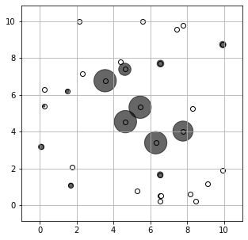

<script src="https://cdn.mathjax.org/mathjax/latest/MathJax.js?config=TeX-AMS-MML_HTMLorMML" type="text/javascript"></script>

### Adaptive robust optimization for a lot-sizing problem

In this example, we consider a lot-sizing problem described in [Bertsimas et al. (2016)](#ref1). In a network with \\(N\\) stores, the stock allocation \\(x_i\\) for each store \\(i\\) is determined prior to knowing the realization of the demand at each location. The demand, denoted by the vector \\(d\\),  is uncertain and assumed to be in a budget uncertainty set

$$
\mathcal{U}=\left\{\pmb{d}: \pmb{0}\leq \pmb{d} \leq d_{\text{max}}\pmb{e}, \pmb{e}^T\pmb{d} \leq \Gamma\right\}.
$$

After the demand realization of demand is observed, stock \\(y_{ij}\\) could be transported from store \\(i\\) to store \\(j\\) at a cost of \\(t_{ij}\\), in order to meet all demand. The objective is to minimize the worst-case total cost, expressed as the storage cost (with unit cost \\(c_i\\) for each store \\(i\\)) and cost of shifting products from one store to another. Such an adaptive model can be written as

$$
\begin{align}
\min~&\max\limits_{\pmb{d}\in\mathcal{U}} \sum\limits_{i=1}^Nc_ix_i + \sum\limits_{i=1}^N\sum\limits_{j=1}^Nt_{ij}y_{ij}  && &\\
\text{s.t.}~&d_i \leq \sum\limits_{j=1}^Ny_{ji} - \sum\limits_{j=1}^Ny_{ij} + x_i, &&i=1, 2, ..., N, & \forall \pmb{d} \in \mathcal{U} \\
&0\leq x_i\leq K_i, &&i = 1, 2, ..., N &
\end{align}
$$

with \\(K_i\\) to be the stock capacity at each location, and the adaptive decision \\(y_{ij}\\) to be approximated by the affine decision rule

$$
y_{ij}(\pmb{d}) = y_{ij}^0 + \sum\limits_{k=1}^Ny_{ijk}^dd_k.
$$

For a test case, we pick \\(N=30\\) locations uniformly at random from \\([0, 10]^2\\). The shifting cost \\(t_{ij}\\) is calculated as the Euclidean distance between the stores \\(i\\) and \\(j\\), and the storage cost \\(c_i\\) is assumed to be 20. The maximum demand \\(d_{\text{max}}\\) and the stock capacity \\(K_i\\) are both set to be 20 units, and the parameter \\(\Gamma\\) in the uncertainty set is set to \\(20\sqrt{N}\\). Such an adaptive model can be implemented by the following Python code using RSOME.

```python
from rsome import ro
import rsome.grb_solver as grb
import numpy as np
import numpy.random as rd
import matplotlib.pyplot as plt

# Parameters of the lot-sizing problem
N = 30
c = 20
dmax = 20
Gamma = 20*np.sqrt(N)
xy = 10*rd.rand(2, N)
t = ((xy[[0]] - xy[[0]].T) ** 2
     + (xy[[1]] - xy[[1]].T) ** 2) ** 0.5

model = ro.Model()          # define a model
x = model.dvar(N)           # define location decisions
y = model.ldr((N, N))       # define decision rule as the shifted quantities
d = model.rvar(N)           # define random variables as the demand

y.adapt(d)                  # the decision rule y affinely depends on d

uset = (d >= 0,
        d <= dmax,
        sum(d) <= Gamma)    # define the uncertainty set

# define model objective and constraints
model.minmax((c*x).sum() + (t*y).sum(), uset)
model.st(d <= y.sum(axis=0) - y.sum(axis=1) + x)
model.st(y >= 0)
model.st(x >= 0)
model.st(x <= 20)

model.solve(grb)
```

```
Being solved by Gurobi...
Solution status: 2
Running time: 2.8133s
```

The solution is displayed by the following figure, with the bubble size indicating the stock allocations at each location.

```python
plt.figure(figsize=(5, 5))
plt.scatter(xy[0], xy[1], c='w', edgecolors='k')
plt.scatter(xy[0], xy[1], s=40*x.get(), c='k', alpha=0.6)
plt.axis('equal')
plt.xlim([-1, 11])
plt.ylim([-1, 11])
plt.grid()
plt.show()
```


<br>

#### Reference

<a id="ref1"></a>

Bertsimas, Dimitris, and Frans JCT de Ruiter. "[Duality in two-stage adaptive linear optimization: Faster computation and stronger bounds](https://pubsonline.informs.org/doi/abs/10.1287/ijoc.2016.0689)." <i>INFORMS Journal on Computing</i> 28.3 (2016): 500-511.
