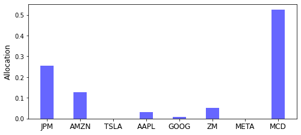

<script src="https://cdn.mathjax.org/mathjax/latest/MathJax.js?config=TeX-AMS-MML_HTMLorMML" type="text/javascript"></script>

### Distributionally Robust Portfolio under Moment Uncertainty

In this example, we will use RSOME to the solve the portfolio problem discussed in [Delage and Ye 2010](#ref1). The portfolio problem is formulated as the following distributionally robust model,

$$
\begin{align}
\min~&\sup\limits_{\mathbb{P}\in\mathcal{F}}\mathbb{E}\left[\alpha + \frac{1}{\epsilon}\max\left\{-\tilde{\pmb{\xi}}^{\top}\pmb{x} - \alpha, 0\right\}\right] \\
\text{s.t.}~&\pmb{e}^{\top}\pmb{x}=1, \pmb{x}\in\mathbb{R}_+^{n}.
\end{align}
$$

where \\(\tilde{\pmb{\xi}}\in\mathbb{R}^n\\) is a random vector representing the uncertain returns of \\(n\\) stocks, and the objective function minimizes the conditional value-at-risk (CVaR) of the investment return under the worst-case distribution \\(\mathbb{P}\\) over the ambiguity set \\(\mathcal{F}\\), defined below

$$
\mathcal{F} = \left\{
\mathbb{P}\in\mathcal{P}_0\left(\mathbb{R}^n\right) \left|
\begin{array}
\tilde{\pmb{\xi}} \sim \mathbb{P} \\
\left(\mathbb{E}[\tilde{\pmb{\xi}}] - \mu\right)^{\top}\Sigma^{-1}\left(\mathbb{E}[\tilde{\pmb{\xi}}] - \mu\right) \leq \gamma_1 \\
\mathbb{E}\left[\left(\tilde{\pmb{\xi}}-\mu\right)\left(\tilde{\pmb{\xi}}-\mu\right)^{\top}\right] \preceq \gamma_2 \Sigma
\end{array}
\right.
\right\}.
$$

According to [Delage and Ye 2010](#ref1), the distributionally robust model is equivalent to the following convex optimization problem

$$
\begin{align}
\min~&r + t \\
\text{s.t.}~&
\left(
\begin{array}
\\\pmb{Q} & \pmb{q}/2 + (1/\epsilon)\pmb{x}/2 \\
\pmb{q}^{\top}/2 + (1/\epsilon)\pmb{x}^{\top}/2 & r + (1-\epsilon)/\epsilon\alpha
\end{array}
\right) \succeq 0\\
&\left(
\begin{array}
\\\pmb{Q} & \pmb{q}/2 \\
\pmb{q}^{\top}/2 & r - \alpha
\end{array}
\right) \succeq 0\\
&t \geq (\gamma_2\pmb{\Sigma} + \pmb{\mu}\pmb{\mu}^{\top}) \boldsymbol{\cdot} \pmb{Q} + \pmb{\mu}^{\top}\pmb{q} + \sqrt{\gamma_1}\|\pmb{\Sigma}^{1/2}(\pmb{q} + 2\pmb{Q\mu})\| \\
&\pmb{Q} \succeq 0 \\
&\pmb{e}^{\top}\pmb{x}=1, \pmb{x}\in\mathbb{R}_+^{n}.
\end{align}
$$

In the numerical experiments below, the mean returns \\(\pmb{\mu\}\\) and covariance matrix \\(\pmb{\Sigma}\\) are estimated using the sample data of eight stocks "JPM", "AMZN", "TSLA", "AAPL", "GOOG", "ZM", "META", and "MCD", in the year of 2021.

```python
import pandas as pd
import yfinance as yf

stocks = ['JPM', 'AMZN', 'TSLA', 'AAPL', 'GOOG', 'ZM', 'META', 'MCD']
start = '2021-01-01' 
end='2021-12-31'

data = pd.DataFrame([])
for stock in stocks:
    each = yf.Ticker(stock).history(start=start, end=end)
    close = each['Close'].values
    returns = (close[1:] - close[:-1]) / close[:-1]
    data[stock] = returns

data
```

<div>
<table border="1" class="dataframe mystyle">
  <thead>
    <tr style="text-align: right;">
      <th></th>
      <th>JPM</th>
      <th>AMZN</th>
      <th>TSLA</th>
      <th>AAPL</th>
      <th>GOOG</th>
      <th>ZM</th>
      <th>META</th>
      <th>MCD</th>
    </tr>
  </thead>
  <tbody>
    <tr>
      <th>0</th>
      <td>0.005441</td>
      <td>0.010004</td>
      <td>0.007317</td>
      <td>0.012364</td>
      <td>0.007337</td>
      <td>0.002361</td>
      <td>0.007548</td>
      <td>0.005994</td>
    </tr>
    <tr>
      <th>1</th>
      <td>0.046956</td>
      <td>-0.024897</td>
      <td>0.028390</td>
      <td>-0.033662</td>
      <td>-0.003234</td>
      <td>-0.045506</td>
      <td>-0.028269</td>
      <td>-0.002270</td>
    </tr>
    <tr>
      <th>2</th>
      <td>0.032839</td>
      <td>0.007577</td>
      <td>0.079447</td>
      <td>0.034123</td>
      <td>0.029943</td>
      <td>-0.005546</td>
      <td>0.020622</td>
      <td>0.004645</td>
    </tr>
    <tr>
      <th>3</th>
      <td>0.001104</td>
      <td>0.006496</td>
      <td>0.078403</td>
      <td>0.008631</td>
      <td>0.011168</td>
      <td>0.020759</td>
      <td>-0.004354</td>
      <td>0.018351</td>
    </tr>
    <tr>
      <th>4</th>
      <td>0.014924</td>
      <td>-0.021519</td>
      <td>-0.078214</td>
      <td>-0.023249</td>
      <td>-0.022405</td>
      <td>-0.034038</td>
      <td>-0.040102</td>
      <td>-0.007597</td>
    </tr>
    <tr>
      <th>...</th>
      <td>...</td>
      <td>...</td>
      <td>...</td>
      <td>...</td>
      <td>...</td>
      <td>...</td>
      <td>...</td>
      <td>...</td>
    </tr>
    <tr>
      <th>245</th>
      <td>0.003574</td>
      <td>0.000184</td>
      <td>0.057619</td>
      <td>0.003644</td>
      <td>0.001317</td>
      <td>-0.007663</td>
      <td>0.014495</td>
      <td>0.003812</td>
    </tr>
    <tr>
      <th>246</th>
      <td>0.005723</td>
      <td>-0.008178</td>
      <td>0.025248</td>
      <td>0.022975</td>
      <td>0.006263</td>
      <td>-0.021967</td>
      <td>0.032633</td>
      <td>0.008610</td>
    </tr>
    <tr>
      <th>247</th>
      <td>0.003035</td>
      <td>0.005844</td>
      <td>-0.005000</td>
      <td>-0.005767</td>
      <td>-0.010914</td>
      <td>-0.019580</td>
      <td>0.000116</td>
      <td>-0.001342</td>
    </tr>
    <tr>
      <th>248</th>
      <td>-0.000504</td>
      <td>-0.008555</td>
      <td>-0.002095</td>
      <td>0.000502</td>
      <td>0.000386</td>
      <td>-0.010666</td>
      <td>-0.009474</td>
      <td>0.002277</td>
    </tr>
    <tr>
      <th>249</th>
      <td>-0.000505</td>
      <td>-0.003289</td>
      <td>-0.014592</td>
      <td>-0.006578</td>
      <td>-0.003427</td>
      <td>0.047907</td>
      <td>0.004141</td>
      <td>-0.004767</td>
    </tr>
  </tbody>
</table>
<p>250 rows × 8 columns</p>
</div>

```python
μ = data.mean().values
Σ = data.cov().values
```

Parameters \\(\gamma_1\\) and \\(\gamma_2\\) in the ambiguity set \\(\mathcal{F}\\), together with the risk tolerance level \\(\epsilon\\), are specified in the code segment below.

```python
γ1, γ2 = 0.25, 1.50
ε = 0.05
```

The equivalent convex optimization problem can be then implemented by the following python code.

```python
from rsome import ro
from rsome import msk_solver as msk
import rsome as rso
from scipy.linalg import sqrtm

model = ro.Model()

n = len(μ)
x = model.dvar(n)
α = model.dvar()
Q = model.dvar((n, n))
q = model.dvar(n)
r = model.dvar()
t = model.dvar()
s = model.dvar()

model.min(r + t)
model.st(t >= γ2*(Σ*Q).sum() + μ@Q@μ + μ@q + 
         γ1**0.5*rso.norm(sqrtm(Σ)@(q + 2*Q@μ)))

vec = (q*0.5 + (1/ε)*x*0.5)[None, :]
model.st(rso.rstack([Q, vec.T],
                    [vec, r+(1-ε)/ε*α]) >> 0)

vec = (q*0.5)[None, :]
model.st(rso.rstack([Q, vec.T],
                    [vec, r-α]) >> 0)

model.st(Q >> 0)
model.st(x >= 0, x.sum() == 1)

model.solve(msk)

print(f'Objective value: {model.get():.6f}')
```

```
Being solved by Mosek...
Solution status: Optimal
Running time: 0.0199s
Objective value: 0.042948
```


Note that the ambiguity set \\(\mathcal{F}\\) can also be written as the following lifted version, 

$$
\mathcal{G} = \left\{
\mathbb{P}\in\mathcal{P}_0\left(\mathbb{R}^n\times\mathbb{S}^n\right) \left|
\begin{array}{l}
(\tilde{\pmb{\xi}}, \tilde{\pmb{U}}) \sim \mathbb{P} \\
\mathbb{P}\left[
\left(
\begin{array}{ll}
\tilde{\pmb{U}} & \tilde{\pmb{\xi}} - \pmb{\mu} \\
\tilde{\pmb{\xi}}^{\top} - \pmb{\mu}^{\top} & 1
\end{array}
\right) \succeq 0
\right] = 1 \\
\left(\mathbb{E}[\tilde{\pmb{\xi}}] - \mu\right)^{\top}\Sigma^{-1}\left(\mathbb{E}[\tilde{\pmb{\xi}}] - \mu\right) \leq \gamma_1 \\
\mathbb{E}\left[\tilde{\pmb{U}}\right] = \gamma_2 \Sigma
\end{array}
\right.
\right\},
$$

where the support of the ambiguity set is used to enforce the constraint \\(\left(\tilde{\pmb{\xi}} - \pmb{\mu}\right)\left(\tilde{\pmb{\xi}} - \pmb{\mu}\right)^{\top} \preceq \tilde{\pmb{U}}\\). Such an ambiguity set can be directly constructed using the RSOME package, so the distributionally robust optimization model can be implemented in a more concise and readable manner.

```python
from rsome import dro
from rsome import msk_solver as msk
from rsome import E
import rsome as rso
import numpy as np

model = dro.Model()

n = len(μ)
x = model.dvar(n)
α = model.dvar()

ξ = model.rvar(n)
U = model.rvar((n, n))
gset = model.ambiguity()
gset.suppset(rso.rstack([U, (ξ - μ)[:, None]],
                        [(ξ - μ)[None, :], 1]) >> 0)
inv_Σ = np.linalg.inv(Σ)
gset.exptset(rso.quad(E(ξ) - μ, inv_Σ) <= γ1,
             E(U) == γ2*Σ)

model.minsup(α + (1/ε)*E(rso.maxof(-ξ@x - α, 0)), gset)
model.st(x.sum() == 1, x >= 0)

model.solve(msk)

print(f'Objective value: {model.get():.6f}')
```

```
Being solved by Mosek...
Solution status: Optimal
Running time: 0.0304s
Objective value: 0.042948
```

Both convex optimization problems above give the same investment decision, which is visualized by the following code.  

```python
import matplotlib.pyplot as plt

plt.figure(figsize=(8, 3.5))
plt.bar(data.columns, x.get(), width=0.4, color='b', alpha=0.6)
plt.xticks(fontsize=12)
plt.ylabel('Allocation', fontsize=12)
plt.show()
```



#### Reference

<a id="ref1"></a>

Delage, Erick, and Yinyu Ye. 2010. [Distributionally robust optimization under moment uncertainty with application to data-driven problems](https://pubsonline.informs.org/doi/abs/10.1287/opre.1090.0741). Operations Research 58(3) 595-612.