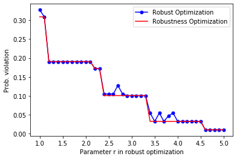

<script src="https://cdn.mathjax.org/mathjax/latest/MathJax.js?config=TeX-AMS-MML_HTMLorMML" type="text/javascript"></script>

# Robust optimization with RSOME

## General robust optimization formulation

The RSOME package is capable of formulating the robust optimization problems as

$$
\begin{align}
\min\limits_{\pmb{x}} ~ &\max\limits_{\pmb{z}\in\mathcal{Z}_0} ~\pmb{z}^T\pmb{A}_0\pmb{x} + \pmb{b}_0^T\pmb{x} + \pmb{c}_0^T\pmb{z} + d_0 &&\\
\text{s.t.}~&\pmb{z}^T\pmb{A}_1\pmb{x}+ \pmb{b}_1^T\pmb{x} + \pmb{c}_1^T\pmb{z} + d_1 \leq 0, &&\forall \pmb{z}\in\mathcal{Z}_1 \\
&\pmb{z}^T\pmb{A}_2\pmb{x}+ \pmb{b}_2^T\pmb{x} + \pmb{c}_2^T\pmb{z} + d_2 \leq 0, &&\forall \pmb{z}\in\mathcal{Z}_2 \\
& \vdots \\
&\pmb{z}^T\pmb{A}_m\pmb{x}+ \pmb{b}_m^T\pmb{x} + \pmb{c}_m^T\pmb{z} + d_m \leq 0, &&\forall \pmb{z}\in\mathcal{Z}_m \\
& \pmb{x} \in \mathcal{X}.
\end{align}
$$

where \\(\pmb{x}\\) is the array decision variables, and \\(\pmb{z}$\\) is the array of random variables. The generic formula above suggests that we are minimizing (or maximizing) the objective function under the worst-case realization of the uncertainty set \\(\mathcal{Z}_0\\), subject to the worst-case constraints over each uncertainty set \\(\mathcal{Z}_j\\), \\(\forall j \in 1, 2, ..., m\\). The RSOME package provides rich algebraic tools for specifying random variables arrays, uncertainty sets, the worst-case objective and constraints of the robust model.

## Random variables

Random variables of a robust optimization model can be defined by the method <code>rvar()</code> of the model object.

```
rvar(shape=(1,), name=None) method of rsome.ro.Model instance
    Returns an array of random variables with the given shape.

    Parameters
    ----------
    shape : int or tuple
        Shape of the variable array.
    name : str
        Name of the variable array

    Returns
    -------
    new_var : rsome.lp.Vars
        An array of new random variables
```

Similar to decision variables, random variables are also formulated as arrays, and all array operations and functions aforementioned, including operations between decision and random variables, could be applied.


```python
from rsome import ro

model = ro.Model()          # Create a model object
x = model.dvar((1, 5))      # A 1x5 array of decision varaibles
y = model.dvar((2, 1))      # A 2x1 array of decision variables
z = model.rvar((2, 5))      # A 2x5 array of random variables

model.st(x * z <= 2)        # Multiplication with broadcasting
model.st(y.T@z - x <= 5)    # Matrix multiplication
```

## Uncertainty sets

The uncertainty set \\(\mathcal{Z}_0\\) for the objective function can be specified by the method <code>minmax()</code> and <code>maxmin()</code>. Take the following uncertainty set \\(\mathcal{Z}_0\\) for example,  

$$
\begin{align}
\mathcal{Z}_0 = \left\{\pmb{z}:
\|\pmb{z}\|_{\infty} \leq 1,
\|\pmb{z}\|_1 \leq 1.5  
\right\},
\end{align}
$$

it is used to define the worst-case objective functions, which can be written as the following code.

```python
from rsome import ro
import rsome as rso
import numpy as np

model = ro.Model()          
x = model.dvar((2, 5))      
z = model.rvar((1, 5))    

# Define uncertainty set Z0 as a tuple
z_set0 = (rso.norm(z, np.inf) <= 1,   
          rso.norm(z, 1) <= 1.5)

# Minimize the worst-case objective over the uncertainty set Z0
model.minmax((x*z).sum(), z_set0)    

# Maximize the worst-case objective over the uncertainty set Z0
model.maxmin((x*z).sum(), z_set0)
```

In the functions <code>minmax()</code> and <code>maxmin()</code>, the first argument is the objective function, and all the remaining arguments are used to specify the constraints of the uncertainty set \\(\mathcal{Z}_0\\).

For constraints, uncertainty sets can be specified by the <code>forall()</code> method of constraints involving random variables, as shown by the following example.


```python
# Define uncertainty set Z1 as a tuple
z_set1 = (rso.norm(z, np.inf) <= 1.5,
          rso.norm(z, 1) <= 2)

# The constraints over the uncertainty set Z1
model.st((x*z + z >= 0).forall(z_set1))
```

Please note that if the uncertainty set of a robust constraint is not defined, then by default, its uncertainty set is \\(\mathcal{Z}_0\\), defined by the `minmax()` or `maxmin()` methods for the objective. The code below demonstrates a case where one uncertainty set \\(\mathcal{Z}_0\\) applies to the objective function and all constraints.


```python
from rsome import ro
import rsome as rso

model = ro.Model()          
x = model.dvar((2, 5))      
z = model.rvar((1, 5))    

# Define uncertainty set Z0 as a tuple
z_set0 = (rso.norm(z, np.inf) <= 1,   
          rso.norm(z, 1) <= 1.5)

# Define objective function and the uncertainty set
model.minmax((x*z).sum(), z_set0)  

# The uncertainty set Z0 applies to all constraints below
model.st(x*z + z >= 0)
model.st(x*z + x >= 0)
model.st(x >= z)
```

It can be seen that uncertainty sets of the robust model can be flexibly specified. More application examples are presented in the next section.

## Application examples

### Robust portfolio optimization

In this example, the portfolio construction problem discussed in the previous sections is solved by a robust optimization approach introduced in the paper [The Price of Robustness](https://www.researchgate.net/publication/220244391_The_Price_of_Robustness). The robust model is presented below.

$$
\begin{align}
\max~&\min\limits_{\pmb{z}\in\mathcal{Z}} \sum\limits_{i=1}^n\left(p_i + \delta_iz_i \right)x_i \\
\text{s.t.}~&\sum\limits_{i=1}^nx_i = 1 \\
&x_i \geq 0, ~\forall i = 1, 2, ..., n,
\end{align}
$$

where the affine term \\(p_i + \delta_iz_i\\) represents the random stock return, and the random variable is between \\([-1, 1]\\), so the stock return has an arbitrary distribution in the interval \\([p_i - \delta_i, p_i + \delta_i]\\). The uncertainty set \\(\mathcal{Z}\\) is given below,

$$
\begin{align}
\mathcal{Z} = \left\{\pmb{z}: \|\pmb{z}\|_{\infty} \leq 1, \|\pmb{z}\|_1 \leq \Gamma\right\},
\end{align}
$$

where \\(\Gamma\\) is the budget of uncertainty parameter. Values of the budget of uncertainty and other parameters are presented as follows.

$$
\begin{align}
& \Gamma = 5 &\\
& p_i = 1.15 + i\frac{0.05}{150}, &\forall i = 1, 2, ..., n \\
& \delta_i = \frac{0.05}{450}\sqrt{2in(n+1)}, &\forall i = 1, 2, ..., n.
\end{align}
$$

The robust optimization model can be implemented by the following Python code.


```python
from rsome import ro
from rsome import grb_solver as grb
import rsome as rso
import numpy as np


n = 150                                 # Number of stocks
i = np.arange(1, n+1)                   # Indices of stocks
p = 1.15 + i*0.05/150                   # Mean returns
delta = 0.05/450 * (2*i*n*(n+1))**0.5   # Deviations of returns
Gamma = 5                               # Budget of uncertainty

model = ro.Model()              
x = model.dvar(n)                       # Fractions of investment
z = model.rvar(n)                       # Random variables

model.maxmin((p + delta*z) @ x,         # The max-min objective
             rso.norm(z, np.infty) <=1, # Uncertainty set constraints
             rso.norm(z, 1) <= Gamma)   # Uncertainty set constraints
model.st(sum(x) == 1)                   # Summation of x is one
model.st(x >= 0)                        # x is non-negative

model.solve(grb)                        # Solve the model by Gurobi
```

    Being solved by Gurobi...
    Solution status: 2
    Running time: 0.0038s


The optimal investment decision can be visualized by the diagram below.


```python
import matplotlib.pyplot as plt

obj_val = model.get()               # The optimal objective value
x_sol = x.get()                     # The optimal investment decision

plt.plot(range(1, n+1), x_sol,
         linewidth=2, color='b')
plt.xlabel('Stocks')
plt.ylabel('Fraction of investment')
plt.show()
print('Objective value: {0:0.4f}'.format(obj_val))
```


    Objective value: 1.1709


### The robust and robustness knapsack problems

In this example, we will use the RSOME package to implement the robust knapsack model introduced in the paper [The Price of Robustness](https://www.researchgate.net/publication/220244391_The_Price_of_Robustness), and the robustness model described in the paper [The Dao of Robustness](http://www.optimization-online.org/DB_FILE/2019/11/7456.pdf). In the knapsack problem, the weight coefficient \\(\tilde{w}_i\\) is assumed to be randomly distributed in the range \\([w_i - \delta_i, ~ w_i + \delta_i]\\). Suppose that each good has a value of \\(c_i\\), then the objective is to maximize the total value of goods. The robust model can be thus written as

$$
\begin{align}
\max~&\sum\limits_{i=1}^nc_i x_i \\
\text{s.t.}~&\sum\limits_{i=1}^n({w}_i + z_i\delta_i)x_i \leq b, \forall \pmb{z} \in \mathcal{Z} \\
&\pmb{x} \in \{0, 1\}^n
\end{align}
$$

with the array \\(\pmb{z}\\) representing random variables, which are constrained by an uncertainty set

$$
\begin{align}
\mathcal{Z}=\left\{\pmb{z}: \|\pmb{z}\|_{\infty} \leq 1, \|\pmb{z}\|_{1} \leq r\right\}.
\end{align}
$$

The parameter $r$ is the budget of uncertainty. The robustness optimization model can be formulated by introducing auxiliary random variables \\(\pmb{u}\\), such that

$$
\begin{align}
\min~&k\\
\text{s.t.}~&\sum\limits_{i=1}^nc_i x_i \geq \tau \\
&\sum\limits_{i=1}^n({w}_i + z_i\delta_i)x_i - b \leq k \sum\limits_{i=1}^nu_i, \forall (\pmb{z}, \pmb{u}) \in \overline{\mathcal{Z}} \\
&\pmb{x} \in \{0, 1\}^n
\end{align}
$$

with \\(\tau\\) to a target of the objective value, and the random variables \\(\pmb{z}\\) and \\(\pmb{u}\\) constrained by an lifted uncertainty set
$$
\begin{align}
\overline{\mathcal{Z}}=\left\{(\pmb{z}, \pmb{u}): |z_i|\leq u_i\leq 1, \forall i=1, 2, ..., n \right\}.
\end{align}
$$

Following the aforementioned papers, parameters \\(\pmb{c}\\), \\({\pmb{w}}\\), and \\(\pmb{\delta}\\) are randomly generated by the code below.


```python
from rsome import ro
from rsome import grb_solver as grb
import rsome as rso
import numpy as np
import numpy.random as rd
import matplotlib.pyplot as plt

N = 50
b = 2000

c = 2*rd.randint(low=5, high=10, size=N)    # Profit coefficients
w = 2*rd.randint(low=10, high=41, size=N)   # Nominal weights
delta = 0.2*w                               # Maximum deviations
```

The robust optimization model for a given budget of uncertainty \\(r\\) is written as a function named <code>robust()</code>.


```python
def robust(r):
    """
    The function robust implements the robust optimiztion model,
    given the budget of uncertainty r
    """

    model = ro.Model('robust')
    x = model.dvar(N, vtype='B')    
    z = model.rvar(N)              

    z_set = (abs(z) <= 1, rso.norm(z, 1) <= r)
    model.max(c @ x)
    model.st(((w + z*delta) @ x <= b).forall(z_set))

    model.solve(grb, display=False) # Disable solution message

    return model.get(), x.get()     # Optimal objective and solution
```

Similarly, the robustness optimization model for a given target of profit \\(\tau\\) can also be written as a function <code>robustness()</code>.


```python
def robustness(tau):
    """
    The function robustness implements the robustness optimization
    model, given the profit target tau.
    """

    model = ro.Model('robustness')

    x = model.dvar(N, vtype='B')    
    k = model.dvar()              
    z = model.rvar(N)           
    u = model.rvar(N)           

    z_set = (abs(z) <= u, u <= 1)
    model.min(k)
    model.st(c @ x >= tau)
    model.st(((w + z*delta) @ x - b <= k*u.sum()).forall(z_set))
    model.st(k >= 0)

    model.solve(grb, display=False) # Disable solution message

    return model.get(), x.get()     # Optimal objective and solution
```

Given a decision \\(\pmb{x}\\) and a sample of the random variable \\(\pmb{z}\\), we write a function <code>sim()</code> to calculate the probability of constraint violation, as an indicator of the performance of solutions.


```python
def sim(x_sol, zs):
    """
    The function sim is for calculating the probability of violation
    via simulations.
        x_sol: solution of the Knapsack problem
        zs: random sample of the random variable z
    """

    ws = w + zs*delta   # Random samples of uncertain weights

    return (ws @ x_sol > b).mean()

```

According to the paper [The Dao of Robustness](http://www.optimization-online.org/DB_FILE/2019/11/7456.pdf), the robust models are solved first under different budgets of uncertainty. The corresponding objective values are then used as total value targets in the robustness optimization models. Solutions of the robust and robustness models are assessed via simulation to find out the probabilities of violations.


```python
step = 0.1
rs = np.arange(1, 5+step, step)         # All budgets of uncertainty
num_samp = 20000
zs = 1-2*rd.rand(num_samp, N)           # Random samples for z

"""Robust optimization"""
outputs_rb = [robust(r) for r in rs]
targets = [output[0]
           for output in outputs_rb]    # RO Objective as targets
pv_rb = [sim(output[1], zs)
         for output in outputs_rb]      # Prob. of violations

"""Robustness optimization"""
outputs_rbn = [robustness(target)
               for target in targets]   
pv_rbn = [sim(output[1], zs)
          for output in outputs_rbn]    # Prob. of violations
```

Finally, the probabilities of violations for both methods are visualized by the following diagrams.


```python
plt.plot(rs, pv_rb, marker='o', markersize=5, c='b',
         label='Robust Optimization')
plt.plot(rs, pv_rbn, c='r',
         label='Robustness Optimization')

plt.legend()
plt.xlabel('Parameter r in robust optimization')
plt.ylabel('Prob. violation')
plt.show()

plt.scatter(targets, pv_rb, c='b', alpha=0.3,
            label='Robust Optimization')
plt.scatter(targets, pv_rbn, c='r', alpha=0.3,
            label='Robustness Optimization')

plt.legend()
plt.xlabel(r'Target return $\tau$')
plt.ylabel('Prob. violation')
plt.show()
```





